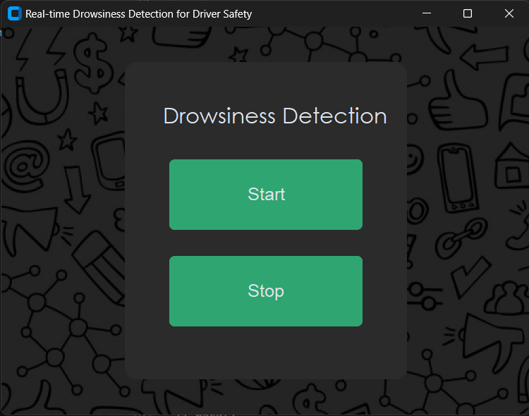

# Real-Time Drowsiness Detection for Driver Safety
<div>
    
    
</div>

## Overview
This project aims to enhance driver safety by detecting drowsiness in real-time using computer vision and machine learning techniques. The system continuously monitors the driver's eyes through a webcam feed and alerts the driver when signs of drowsiness are detected.

## Methodology
The project utilizes a combination of face detection and eye detection techniques to track the driver's facial features, particularly the eyes. A pre-trained deep learning model is employed to classify the state of the driver's eyes as open or closed. When prolonged eye closure, indicative of drowsiness, is detected, the system triggers an alert to warn the driver.

## Used Models
1. **Haar Cascade Classifiers**: Used for face and eye detection. These classifiers are included in the OpenCV library and provide a robust method for detecting faces and eyes in images.

2. **Convolutional Neural Network (CNN)**: A pre-trained CNN model is used for eye state classification. The CNN model has been trained to recognize patterns associated with open and closed eyes.

## Python Libraries Used
- OpenCV (`opencv-python`): For image processing and webcam capture.
- NumPy (`numpy`): For numerical computations and array manipulation.
- TensorFlow (`tensorflow`): For loading and using the pre-trained CNN model.
- Pillow (`Pillow`): For image processing tasks such as image opening and resizing.
- CustomTkinter (`customtkinter`): For creating custom GUI elements in Tkinter.

## Installation
1. **Python**: Ensure you have Python installed on your system. If not, download and install Python from the [official website](https://www.python.org/).

2. **Install Required Libraries**: Install all the required Python libraries using pip. Open a command prompt or terminal and run the following command:
   ```
   pip install opencv-python numpy tensorflow Pillow customtkinter
   ```

This command will install all the necessary Python libraries (`opencv-python`, `numpy`, `tensorflow`, `Pillow`, `customtkinter`) required to run the drowsiness detection system.

## Dataset
- The input dataset should be divided into two files: one for open eyes and another for closed eyes.
- You can download the dataset from [this link](http://mrl.cs.vsb.cz/eyedataset).

## Output
The system displays a real-time video feed from the webcam with overlaid rectangles indicating detected faces and eyes. When drowsiness is detected (i.e., prolonged eye closure), an alert is triggered, and a sound notification is played to warn the driver.

## Contributors
- [Your Name](https://github.com/yourusername)

---

Feel free to customize this README file further to include any additional information or instructions specific to your project.
